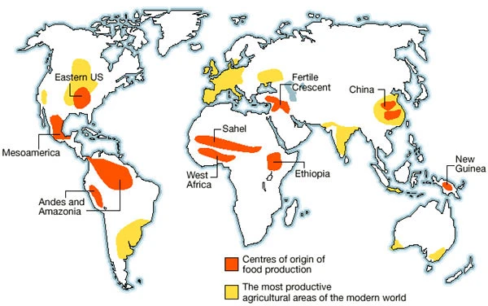
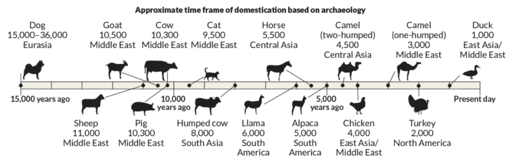
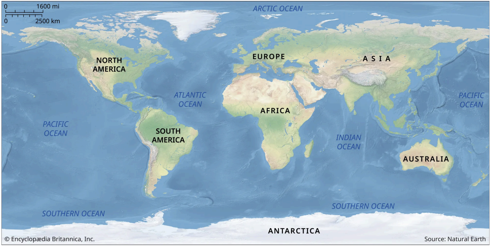

> [!note] About these notes
> A very cool book. Similar to *Sapiens* and [[enlightenment-now|Enlightenment Now]] in that it offers a new perspective on human history. It sets out to answer "why were Europeans the ones to colonise the Americas, Australia, and Africa instead of the other way around?" The answer: not racial superiority of Eurasian peoples, but rather real estate luck of the draw.

Aside from continent-specific details, a few principles determined the course of human history:

- The switch from hunter-gatherer bands of humans to agriculture is significant.
- Agriculture had several consequences:
	- Surplus of food/resources → increase of population size.
	- More resources for development of specialists → technology (writing, steel, guns, tools), politics.
	- Increased structure of societies → improved chances during war.
	- Increased population density → epidemics, resistance.

- Development of agriculture (food production) depended on:
	- **Availability of domesticable plants.**

	  

		- Only a minority of plants are amenable to domestication. Not many more plants have been domesticated in more modern times.

	- **Availability of domesticable animals.**

	  

		- Not all animals are domesticable. Zebras, buffalos, hippos, elephants can't be domesticated even though they would be extremely useful for warfare and agriculture.
		- The main domesticated large mammals were cows, sheep, goats, pigs, horses, donkeys, llamas/alpacas. These can be used for multiple purposes — meat, milk, ploughing, warfare. They confer a massive advantage (horses in war between Spain and South American natives).
		- Animals pass on diseases to humans, which then go on to cause epidemics.

	- **Advantage of food production vs hunting/gathering at the specific time/place** (nobody made the decision in a predictive manner).
		- In some climates (e.g. arctic) hunting is more advantageous.

	- **Proximity to other cultures/communities that already developed food production.**

- Those factors, in turn, depend on the geography of each continent:
	- Dissemination of domesticated plants depends on the major axis of the continent (i.e. North–South or East–West), because plants can move along the same latitude where climate is similar. Other barriers (deserts, mountains) play a role. Thus Eurasia had an advantage over the Americas (N/S + Panama + rainforests), Africa (N/S + Sahara), and Australia (desert). Different continents were also "blessed" with different domesticable plants (the size of Eurasia was an advantage).

	  

	- Availability of animals for domestication varied massively with continent. Big mammals in the Americas and Australia evolved separately from humans for millennia, so didn't have the instincts to avoid them once they appeared. Humans over-hunted them to extinction very quickly — none left for domestication except llamas/alpacas. In Africa, many mammals were unsuitable due to ferocity.
	- Different continents (size, resource availability) can sustain different population sizes and densities. Bigger populations → more frequent interactions (good for exchange of ideas and technology). Interactions also depend on fragmentation due to barriers (sea, desert, mountains).

## Other takeaways

- Diseases were responsible for many more deaths than war (e.g. in the Americas).
- Technologies were often abandoned and cultures "regressed" (Europe did this often).
- Integration can also be bad — China abandoned sea exploration despite a massive headstart, because it was always integrated under one ruler, whereas fragmented Europe meant no single ruler could stop progress. If a technology confers advantage in a fragmented system, it will be adopted or will drive takeover.
- Small initial-condition differences can amplify to produce massive effects down the line (chaos theory).
- It's useful to distinguish between *proximal* and *distal* causes.
