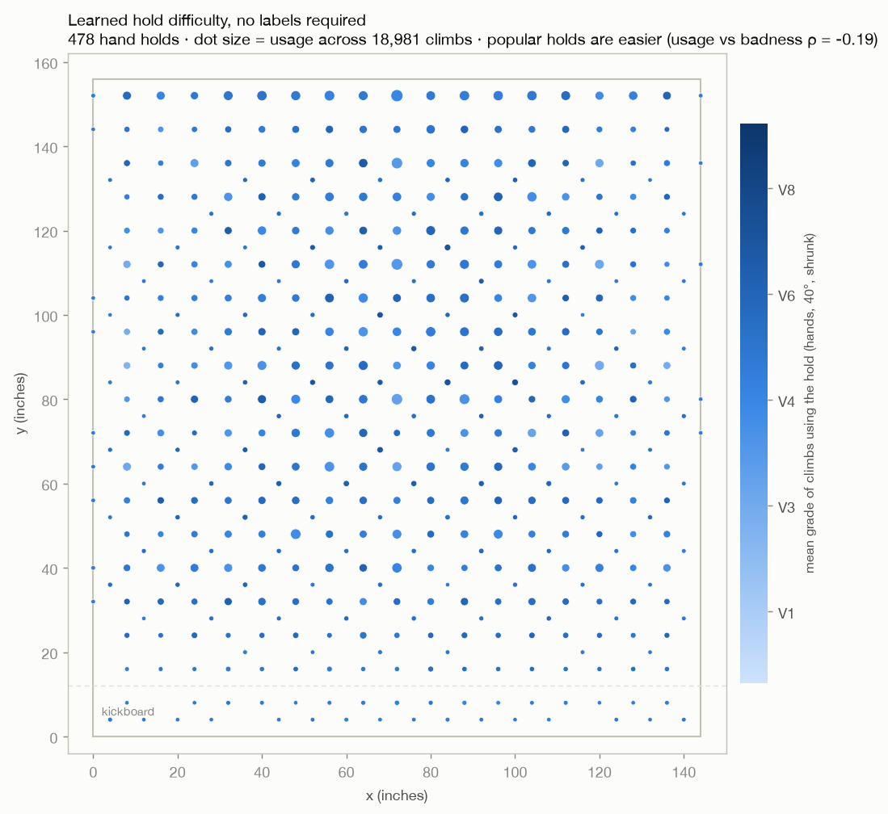
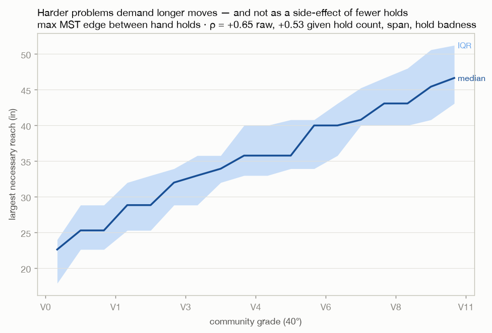
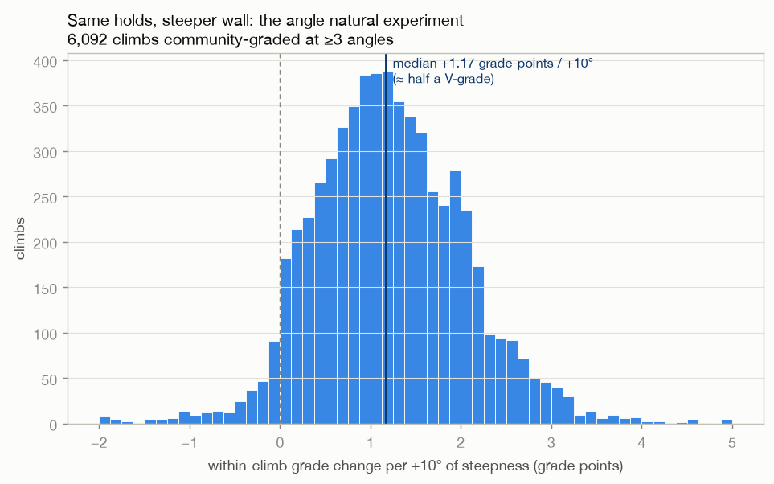
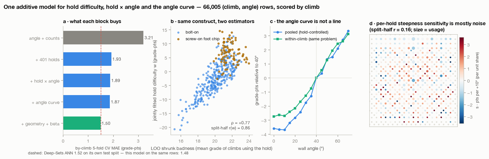
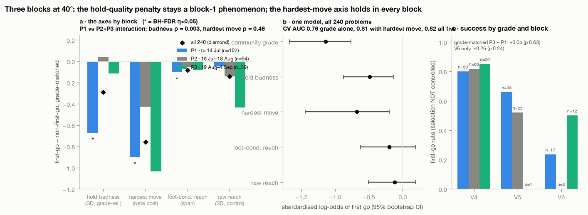
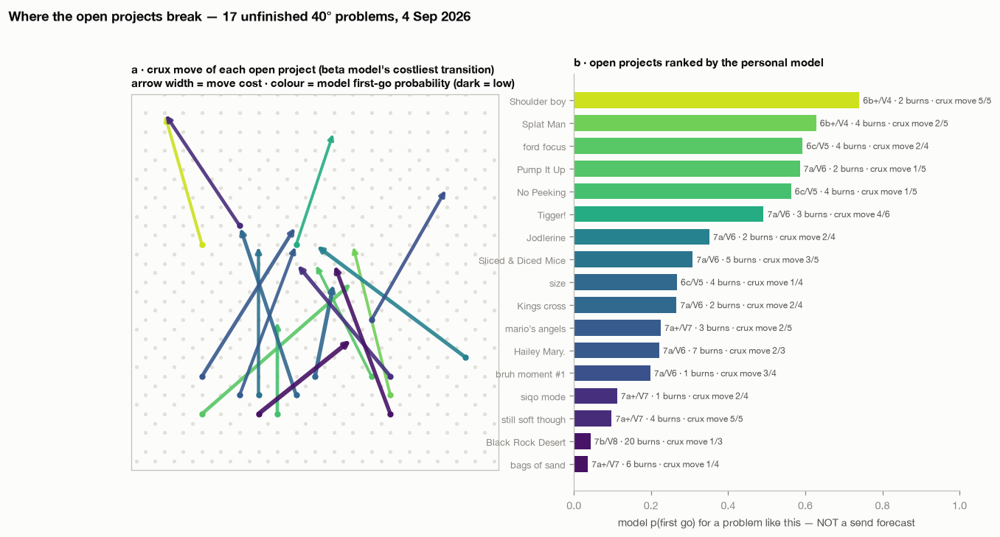

A Kilter board problem is not a photograph of rock. It is a string: `p1129r12p1234r13…`, one placement id and one role per hold, and every placement maps to a hole on a 4-inch grid. That makes the board the only place in climbing where "why is this hard?" is a question you can put to a database. This is what I got out of doing so — first for the whole board, then for my own logbook — and at the bottom there is a tool that runs the same models on any problem and on your logbook, in your browser.

The data is the community's, and it is final. Aurora, which ran the old Kilter app, shut its backend on 25 March 2026 when the two companies split; the last seed database (36,791 problems on the 12×12 Original layout, community-graded at 66,005 (problem, angle) combinations, with ascent counts and star ratings) is a terminal snapshot. If your board life started after that, this analysis cannot see your problems. Grades below are the Aurora scale: V0 = 10, V6 = 22, roughly two points per V-grade, and I quote them as V-grades where a whole grade will do.

## 1. The board sorted its own holds

Nobody labelled a hold. A hold's difficulty is simply the average grade of the problems it appears in as a hand hold, shrunk towards the board mean for holds that are rarely used, and with each problem left out when scoring itself. Do that for the 478 hand-usable holds and the board draws its own map: the pale, big holds low on the wall are easy, the small dark ones in the middle are not, and the correlation between a problem's mean hold difficulty and its community grade is ρ = +0.71 across 18,981 problems at 40°.

Two things fall out that I did not put in. The popular holds are the friendly ones (usage against difficulty, ρ = −0.19). And the one hold type the database does know about — the 89 screw-on "foot chips" that people nevertheless use as hands — are, as hands, 1.7 grade-points worse than the bolt-ons. That is the first named member of what would otherwise stay a family called "bad holds".

The second axis of difficulty is distance. The longest move a problem forces (the largest edge of the minimum spanning tree over its hand holds) climbs from about 23 inches at V0 to about 47 at V10, ρ = +0.65 with grade, and survives controlling for hold count, span and hold difficulty. Some of that is convention — setters partly grade *by* reach — and some is biomechanics; the data cannot split those.

## 2. Steepness is not a line, and it is not fair

The same problem is often graded at several angles: same holds, same setter, only the wall moves. Across 6,092 problems graded at three or more angles the median cost is +1.17 grade-points per +10° — about half a V-grade.

That cost is not shared out evenly. Deconvolved onto individual holds, the worst fifth of holds cost about +1.56 points per 10° while the jugs cost +0.37: steepness taxes bad holds four times harder than good ones. Two caveats travel with that number. Per-hold steepness sensitivity is only measurable as a group average — refitting the model on random halves of the data, the per-hold values agree at r = 0.16, so the quintile contrast stands and any single hold's number does not. And the angle effect itself is not linear: within the same problem, the grade rises about one point per 10° above 40°, drops about 0.9 per 10° between 40° and 15°, and then stops. At 0°, 5° and 10° a problem is the same grade. Tilting the wall back past 15° buys nothing.

## 3. An additive model beats the neural network

The first pass at prediction was a Deep-Sets network fed raw hold ids: it read grade to a mean absolute error of 1.52 points, about three-quarters of a V-grade, with 71 % of problems within one V-grade. It is a black box.

The second pass is a sum. One term per hold (its difficulty), one term per hold per degree of angle, the angle curve above, the counts of hands and feet, three geometry numbers, and six features from a *sequence* model — a shortest-path search over the hand holds that prices each move by hand span, how far the hands must travel beyond the available feet, hold difficulty and technique penalties (cross-throughs, matches, bumps). The sequence model is hand-tuned and was never fitted to grades; on its own its total cost correlates +0.77 to +0.80 with community grade at every angle.

Scored strictly by problem (no problem informs its own prediction, and every derived feature is rebuilt inside the fold), the additive model scores 1.48 on exactly the test rows where the network scored 1.52, with 72 % within one V-grade. Better, and every point is accounted for: the holds are worth 1.3 points of error, the angle curve 0.06, the move sequence 0.37. The network's edge was never "raw hold identities"; it was interactions between holds, which the sequence model prices as moves.

The tool below shows the sum for any problem: which holds carry the grade, what the angle adds, and which move the model thinks is the crux.

## 4. Then I did it to myself

My own logbook — the new Kilter app's export, my training tracker and the pre-split Aurora export merged and deduplicated — holds 240 problems at 40° over five months. The question a logbook can answer that a population cannot is *which part of difficulty is mine*: at exactly matched community grade, what separates the problems I did first go from the ones I had to work?

In July the answer was hold quality, and it was clean: my first-go problems used holds two-thirds of a standard deviation better than my worked ones (permutation p = 0.001), and reach was nothing. I wrote it down, registered the prediction that it would hold, and kept climbing. When I doubled the data the effect was gone — not weaker, gone: −0.67 SD in the first block, +0.04 in the next, then −0.12 in the one after that (the difference between blocks is significant, p = 0.003). Over the same period I had moved my route selection onto worse holds at matched grade, without my success rate changing. The thing that *did* replicate, in every block and with the same sign, is the sequence model's hardest move: −0.76 pooled, p = 0.001. Reach, raw, is nothing; reach *given where the feet are* is most of what the hardest move is measuring.

Put all of it in one logistic model and the ranking is the same — grade first, hardest move second, hold quality third and only in the first block. So the honest description of my style is: at a given grade, the single most expensive move on the board's optimal sequence is what decides whether I do a problem first go. Hold quality did, once, and does not now. Whether that is adaptation or selection I cannot say — climbing more bad-hold problems is simultaneously the treatment and the measurement — and the useful lesson is the method one: split your logbook by block before you call anything a trait. Mine did not survive its own follow-up.

The scored list at the end of that figure is the practical output: the seventeen problems I have not finished, ranked by the personal model, with the sequence model's crux drawn on the board. Ten of the seventeen break on the first or second move, low on the wall, feet still on the kickboard.

## 5. Do this without code

Twenty attempts at one grade you are solid on, not your limit. For each, two extra columns: hold quality out of five, and whether you had a foot where you needed one on the move you fell off. Then see which column separates your first-goes. If it is hold quality, steepness is your specific enemy (section 2). If it is the feet, the fix is body position and footwork on the moves where the feet run out, not a hangboard. Either way, do it again next block before you believe it.

Or paste a logbook into the tool.

## 6. The tool

<iframe src="/side-projects/kilter/board" style="width:100%;height:1700px;border:0;border-radius:12px" title="Kilter Board Explainer" loading="lazy"></iframe>

Open it full-screen: [Kilter Board Explainer](/side-projects/kilter/board). Nothing is uploaded — the catalogue (about 3 MB) loads into your browser and the logbook analysis runs there. It reads the CSV template, the JSON from the local Kilter puller, and an Aurora data export; names are matched exactly and ambiguous ones are skipped, not guessed. The grade-relative comparisons use the 40° population, so the logbook analysis runs at your most-climbed angle and is exact only at 40°.

## Method notes, briefly

Hold difficulty: leave-one-out shrunk mean grade, k = 20, 40° problems with ≥ 5 ascensionists. Hold × angle: within-problem grade slopes deconvolved onto holds by weighted ridge; the additive model fits holds, hold × angle, an angle curve, counts, geometry and the six sequence features jointly by sparse ridge on all 66,005 rows, scored by grouped 5-fold cross-validation and on the network's exact 80/10/10 split. Personal contrasts: first-go minus not, permuted 5,000 times within exact grade, false-discovery-rate corrected across four axes; blocks split by first-encounter date, with the block label shuffled within (grade, outcome) cells for the interaction test. Every consequential analysis was registered as a falsifiable prior before it ran and scored afterwards; eleven of fourteen held this month, and the misses are in the report. Code, figures, priors and the full write-up: the `kilter-analysis` repository.
