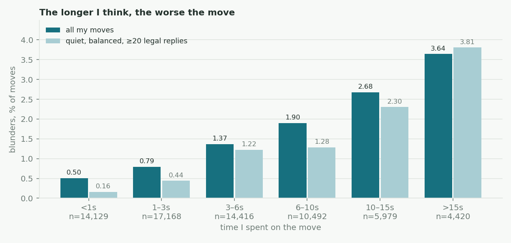
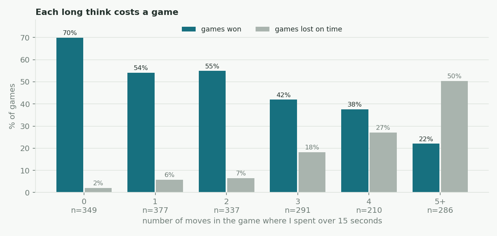
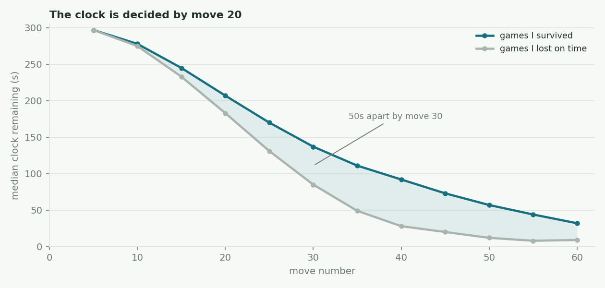
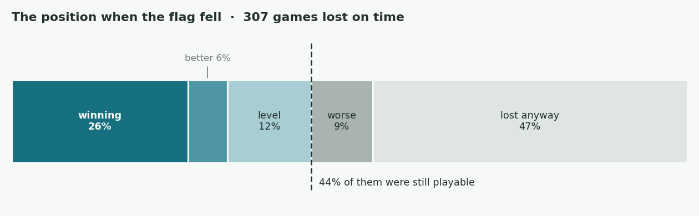

I am a mediocre blitz player and I wanted to know why, in the specific rather than the general sense. The standard diagnosis for someone stuck around 1500 is that they hang pieces and should do more tactics puzzles. That is a hypothesis, and I had 1,855 games sitting on a server that could test it.

So I pulled the lot — every rated blitz game I have played since 2020, all at five minutes a side — and ran Stockfish over all 118,151 distinct positions. Every move I have made, scored, with the clock reading attached to it.

The tactics hypothesis was wrong, and it was wrong in a way I did not expect.

## My slow moves are my worst moves

Blunder rate rises with every second I spend. Not a curve with a sweet spot in the middle — a straight climb. The moves I play instantly are seven times safer than the moves I agonise over.

The obvious objection is that this is backwards: I think longer in harder positions, and harder positions produce more blunders. So the pale bars are the same measurement with the easy explanations stripped out — captures excluded (a forced recapture is instant and cannot be a blunder), positions with fewer than twenty legal replies excluded, and only positions Stockfish rates as objectively balanced. On that strict subset the gap gets *wider*: 0.16% against 3.81%, a factor of twenty-four. The effect also holds inside every band of position complexity I can define, and it has been stable across every year of the data.

I cannot fully separate "thinking long causes blunders" from "some quality of a position causes both". What I can say is the weaker claim, and it is the one that matters: **the long think is not rescuing me.** It produces a worse move than my instant ones do, and it costs the thing I actually run out of.

## Because what I run out of is time

I average 2.4 moves per game over fifteen seconds. They eat a quarter of my thinking time across six per cent of my moves, and they predict the result almost perfectly. Games where I never take one, I win seventy per cent. Games with five, I win twenty-two per cent and lose half of them on the clock.

The separation happens early. Games I flag in are not games that went long and complicated; they diverge from the games I survive around move fifteen, and by move thirty there is a fifty-second gap that never closes. If I never drop below thirty seconds I win 60.5% of the time. If I do, 20.4%.

Some of that deficit is spent before the position is even sharp: I use an average of 53 seconds reaching move twelve, which is eighteen per cent of my clock on moves that are mostly still theory.

## Which is how I lose games I have already won

307 of my 867 losses are flag-falls — 35% of everything I lose, against 126 games I win the same way. Net, the clock costs me 181 games.

And they are not games I was losing anyway. Forty-four per cent of them were still playable when the flag fell, and in a quarter of them I was outright winning: the median material edge in that group was a full rook, and in nineteen games I was up a queen or more. These are positions where any sequence of instant legal moves wins. The only losing strategy available was to keep thinking.

The same thing shows up from the other direction. I reached a winning position in 1,113 games and lost 255 of them — and 66% of those were flag-falls, not blunders. I do not throw won games by playing badly. I throw them by running out of time trying to play perfectly.

## The part that reframed it for me

I blunder 0.50 times per game. My opponents blunder 0.57 times per game.

On move quality alone I am slightly ahead of the people I lose to, and a one-blunder differential decides nearly every game at this level. I still finish at 48.4%. The entire deficit is the clock, and it is almost exactly the right size to explain the gap.

## What isn't wrong

Three things I would have guessed at, that the data rules out:

- **Tilt.** I win 49.5% after a loss and 48.0% after a win (p = 0.62). Position within a session does nothing, and losing streaks do not predict the next result. If anything it runs backwards — days where I play eleven or more games score better than days where I play one or two.
- **Time pressure itself.** Under ten seconds on the clock I blunder at 2.12%; with over two minutes, 1.23%. Playing fast is not what hurts me. Running out is.
- **My openings.** No line I play more than twenty-five times deviates meaningfully from my average with that colour. There is no repertoire hole here, which was the answer I was most hoping for and least entitled to.

## What I changed

A hard fifteen-second cap on any single move, a target of reaching move twelve with 260 seconds left, and — the counterintuitive one — speeding *up* rather than slowing down on reaching a winning position. Whether it works is a measurement I will make rather than a claim I will assert; the pipeline is a re-run away.

---

**Method.** Games exported from Lichess with clock annotations. The export carried no engine evaluations, so all 118,151 distinct positions were scored locally with Stockfish 18 at depth 12. Centipawn scores are converted to win probability using Lichess's logistic before anything is called a mistake, so a swing from +9 to +5 correctly registers as nothing rather than a four-pawn catastrophe. Errors are classified from the mover's side: a blunder costs at least 30 percentage points of win probability, a mistake 20, an inaccuracy 10.

**Caveats.** Time spent on a move is not randomly assigned — I think longer precisely where I feel uncertain, and that feeling tracks a real difficulty that a legal-move count does not fully capture. The controls narrow this considerably; they do not eliminate it. The session statistics treat games within a sitting as independent when they are not, which makes those p-values anti-conservative — they are null anyway, so it only strengthens that conclusion. And the final ply of each game has no successor position, so 1.4% of my moves are unscored.
