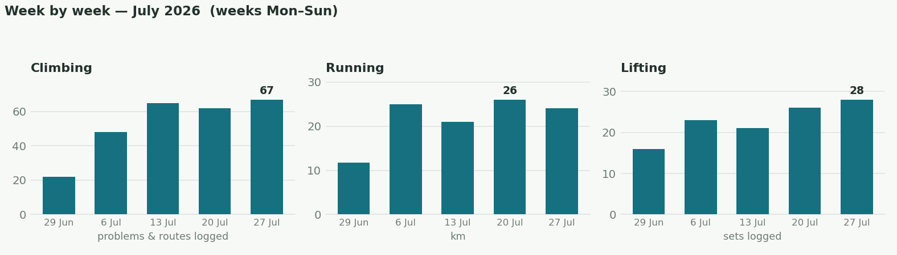
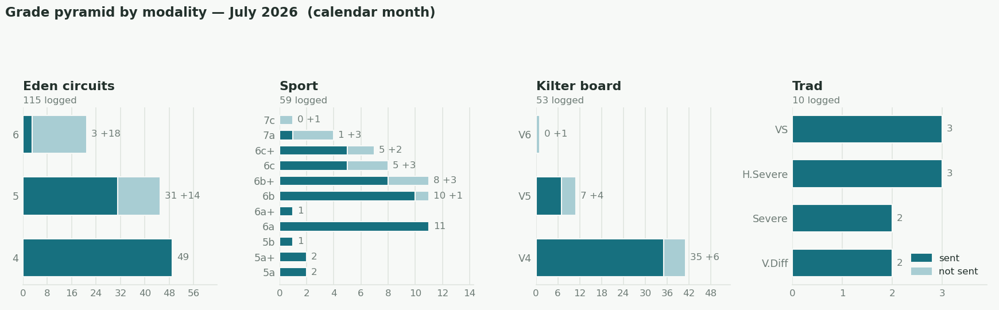
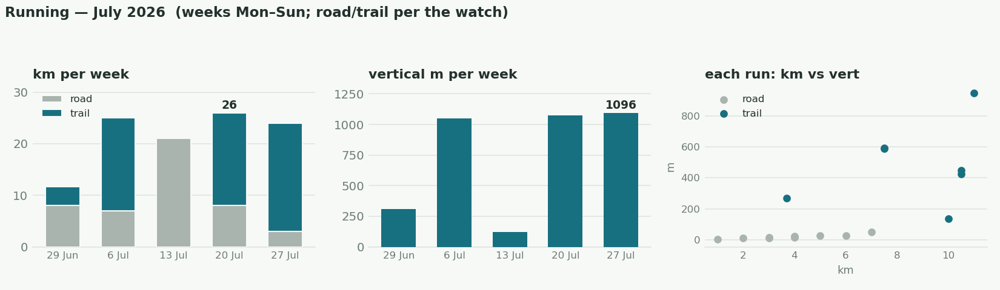
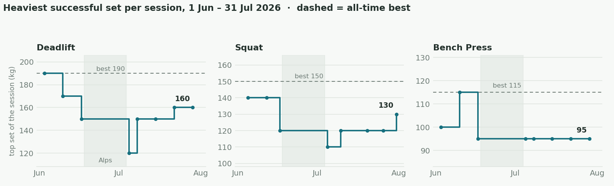
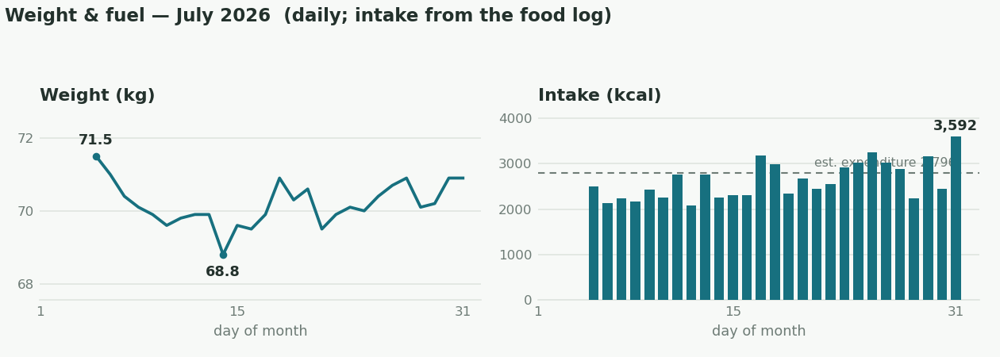
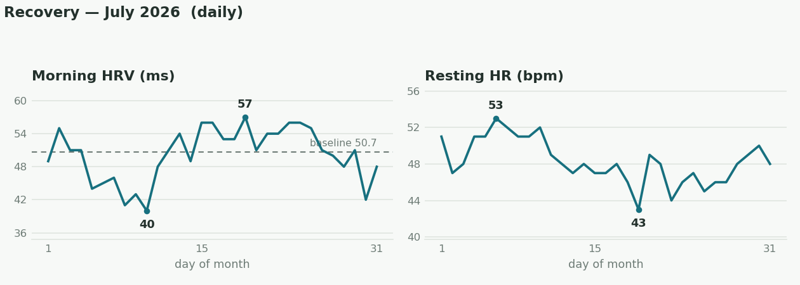

I returned from the [[expeditions/alps2026|Alps]] first days of July. My general idea was to have a phase of building my training/work capacity across all domains. Therefore, my intention was to increase the volume of climbing, running, and weights, without necessarily pushing the intensity higher. E.g. for weights, I wanted to slowly get all the big 3 lifts to a 5 sets x 5 reps range, without pushing my 1RM. The main point of all this is to be able to broaden the base upon which more training and intensity can be added on later. 

## The month in numbers
- **Climbing**: 
	- Did quite a bit of roped climbed to get more mileage, including a few trad days outside. On the Kilter board, I mostly focused on increasing the base of my pyramid with more V4 and V5 problems, rather than pushing the top end. 
	- 264 problems & routes logged, 204 sent. 
- **Running**: 
	- 96 km / 3,342 m elevation gain
	- 5k 20:32 at sub-maximal effort which I ran as kind of a baseline
	- segment PBs: West Kip (27:42 - 6sec faster than my previous PB from at least a year ago), East Kip.
- **Lifting**: 105 sets, all rebuild.

## Climbing

## Running

- Garmin's VO₂max estimate climbed from 55 to 57 across the month, as the running volume came back after the expedition.

## Barbells

| Lift     | First session back (5 Jul) | End of July          | Best ever |
| -------- | -------------------------- | -------------------- | --------- |
| Deadlift | 120 kg                     | 160 kg               | 190 kg    |
| Squat    | 110 kg                     | 130 kg               | 150 kg    |
| Bench    | 95 kg                      | 95 kg (held for 5×5) | 115 kg    |

## Weight & fuel
- Weight: 71.5 kg (5 Jul) → 70.6 (last-week mean; first-week mean 71.0).
- Protein: 165 g/day mean · ≥140 g floor on 25 of 27 logged days.
- Intake ~2,600 kcal/day vs ~2,800 estimated expenditure (energy-balance estimate, not the watch). A bit of overeating towards the end. 
- Food logged 27/31 days.

## Recovery
- Post-expedition autonomic dip: cleared within ~3 days.
- Biggest week of the month: morning markers improving through it.

