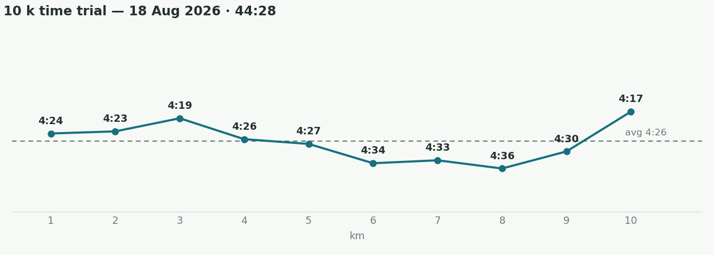
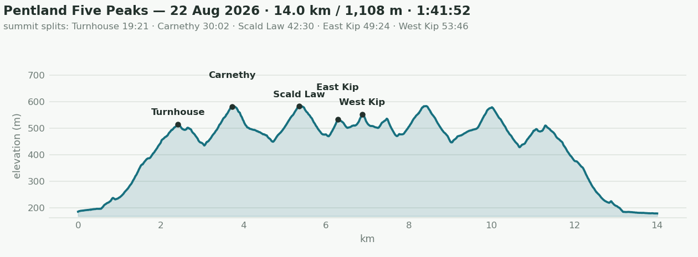
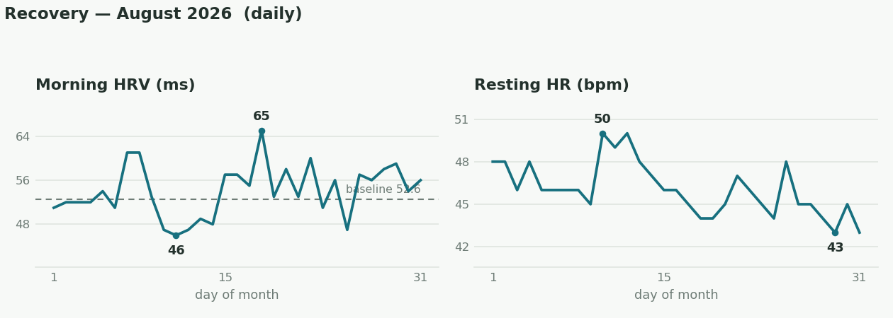
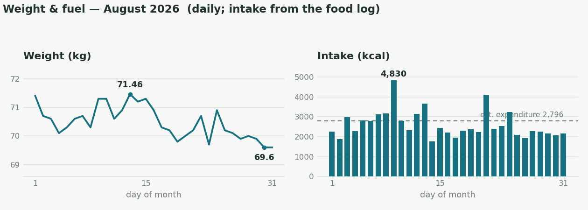

August was one of the best months in recent times! After July's focus on rebuilding volume, August turned into the month of testing. I finally ran the 10k time trial I'd been putting off, did heavy singles on the big three at the end of the month to see where the ceilings actually were, and pushed the top end on the Kilter board. Not all of this was planned to happen quite this way, but by the end of the month I felt quite good physically and wanted to push it and see where I'm at, and also recalibrate my training for the next weeks/months. 

## The month in numbers
- **Climbing**:
	- The top end finally moved: five V6s in the final week, a V7 (mario's angels) that fell on its last move, and Black Rock Desert (V8) done in two overlapping halves — linking it is now the project.
	- 236 problems & routes logged, 167 sent.
- **Running**:
	- 87 km / 3,470 m elevation gain
	- **10k 44:28** (18 Aug) — my first properly maximal 10k. The old PB of 45:36 was a run from years back. 
	- Many trail running segment PBs ×5: Carnethy, Scald Law, East Kip, and West Kip twice (now 27:36).
	- I ran the Pentlands 5 Peaks again (last time was just before the [[alps2026|Alps]]), and improved my time by several minutes! I now have the [FKT](https://fastestknowntime.com/route/pentland-five-peaks-united-kingdom)!
- **Lifting**: 158 sets · ceiling tests at the end of the month (table below) · first one-arm baseline: hang 20 mm −15 kg × 7 s, one-arm pull −10 kg × 3.

## The 10 k

- 44:28 · 4:27/km · avg HR 168 · even halves (22:00 / 22:26) · flat, around the Meadows. This felt pretty hard, harder than I expected in a way, but at least I beat my PB and got my goal of sub-45min. You can see the big dip I had for kilometers 6-9, and then I rallied for the last one! Classic kind of figure from the endurance literature I think, like explained in the book [[endure|Endure]]. The fact that my last km was the fastest one means that when I thought I was at my max during the previous ones, it was just my brain proactively holding something back, since it knew the finish line was still a while to go. 
- Both garmin and some analysis/estimation with claude were over-confident in my abilities (predicting ~42:30). But apparently my threshold durability is something that I definitely need to work on in the coming weeks/months.
- Garmin's VO₂max estimate rose from 57 to 59 over the month, the highest it has ever been!

## Pentland Five Peaks

## Barbell tests

| Lift             | August test            | Best ever         |
| ---------------- | ---------------------- | ----------------- |
| Deadlift         | 190 kg ×1 (195 missed) | 190 kg — equalled |
| Squat            | 150 kg ×1              | 150 kg — equalled |
| Bench            | 110 kg ×1 (120 missed) | 115 kg            |
| Weighted pull-up | +60 kg ×1              | +65 kg            |

- Worth noting: the equalled deadlift and squat PBs came at ~2 kg less body weight than the June originals.
- From 31 Aug I switched to a new scheme: heavier working sets at 3×3 (starting 100 / 170 / 135), and adding reps/weight increments whenever the RPE drops. 

## Elbow

- The brachialis flared three times in nine days mid-month, definitely related to increased volume and worse [[nutrition]]..
- The heaviest pulling week of the block followed, with zero flares. ([[training/brachialis-rehab-schedule|rehab schedule]])

## Climbing

- Board top end week by week: V6 → V7 attempted → V5 → V6 ×5 + V7 last-move → V6 ×5 + V8 in parts.

## Recovery

- Morning HRV averaged 54 ms (range 46–65, the 65 landing the morning of the 10k TT); resting HR drifted down to 43–45 by month end.
- The heaviest week of the block (the test week) ran with both improving through it. In general, it seems like my body likes having more training rather than less. No signs of overtraining so far at all. 

## Weight & fuel
- Weight: 71.4 kg (1 Aug) → 69.6 (31 Aug) · final-week mean 70.1.
- Protein: 174 g/day mean · ≥140 g floor on 28 of 31 days.
- Intake ~2,600 kcal/day vs ~2,800 estimated expenditure (energy-balance estimate, not the watch). One big binge and one small binge, not too bad usually. 
- Food logged 31/31 days.

