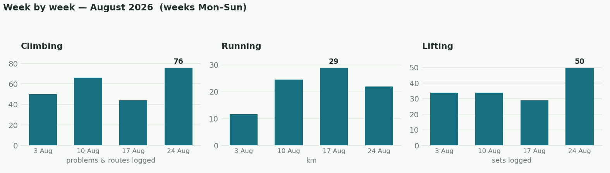
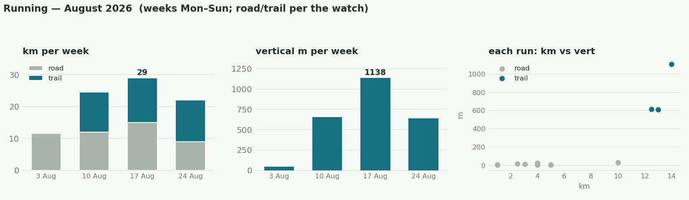
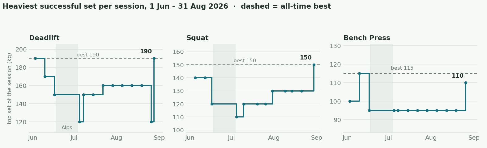
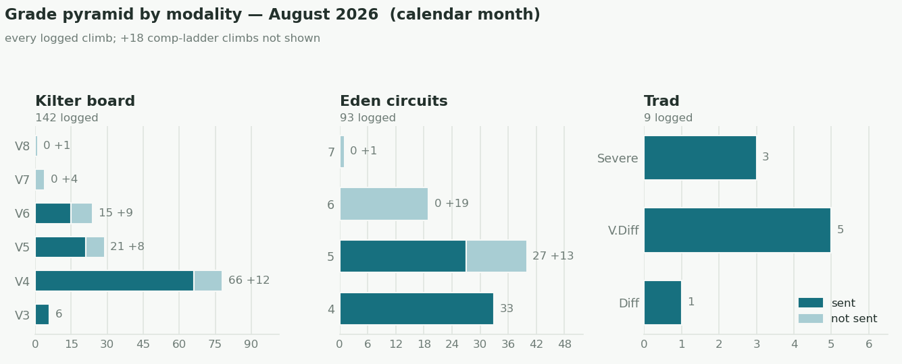

After July's focus on rebuilding volume, August turned into the month of testing. I finally ran the 10k time trial I'd been putting off, did heavy singles on the big three at the end of the month to see where the ceilings actually are, and pushed the top end on the Kilter board. Not all of this was planned to happen quite this way, but by the end of the month every main area had a current, measured number instead of an estimate — which is what I wanted going into the last part of the block (performance phase early Oct).

## The month in numbers
- **Climbing**:
	- The top end finally moved: five V6s in the final week, a V7 (mario's angels) that fell on its last move, and Black Rock Desert (V8) done in two overlapping halves — linking it is now the project.
	- 236 problems & routes logged, 167 sent.
- **Running**:
	- 87 km / 3,470 m elevation gain
	- **10k TT 44:28** (18 Aug) — my first properly maximal 10k. The old "PB" of 45:36 was a training run from years back, never a real race effort.
	- segment PBs ×5: Carnethy, Scald Law, East Kip, and West Kip twice (now 27:36).
- **Lifting**: 158 sets · ceiling tests at the end of the month (table below) · first one-arm baseline: hang 20 mm −15 kg × 7 s, one-arm pull −10 kg × 3.

## The 10 k

- 44:28 · 4:27/km · avg HR 168 · even halves (22:00 / 22:26) · flat, no warm-up.
- The race predictors had been promising ~42:30. The 5k→10k ratio (2.16 vs Riegel's 2.085) says the limiter is holding a hard pace for long — threshold durability — rather than the engine itself.

## Barbell tests

| Lift             | August test            | Best ever         |
| ---------------- | ---------------------- | ----------------- |
| Deadlift         | 190 kg ×1 (195 missed) | 190 kg — equalled |
| Squat            | 150 kg ×1              | 150 kg — equalled |
| Bench            | 110 kg ×1 (120 missed) | 115 kg            |
| Weighted pull-up | +60 kg ×1              | +65 kg            |

- Worth noting: the equalled deadlift and squat PBs came at ~2 kg less body weight than the June originals.
- From 31 Aug I switched to a new scheme: heavier working sets at 3×3 (starting 100 / 170 / 135), adding a small increment (+2.5 / +5 / +10) whenever a week is clean, and no more singles until the performance phase.

## Elbow

- The brachialis flared three times in nine days mid-month, so the protocol I'd written in advance kicked in: hangs down to light repeaters, board limit attempts paused, the new one-arm work shelved for a while.
- The heaviest pulling week of the block followed — with zero flares. ([[training/brachialis-rehab-schedule|rehab schedule]])

## Climbing

- Board top end week by week: V6 → V7 attempted → V5 → V6 ×5 + V7 last-move → V6 ×5 + V8 in parts.

## Weight & fuel
- Weight: 71.4 kg (1 Aug) → 69.6 (31 Aug) · final-week mean 70.1.
- Protein: 174 g/day mean · ≥140 g floor on 28 of 31 days.
- Intake ~2,600 kcal/day vs ~2,800 estimated expenditure (energy-balance estimate, not the watch).
- Food logged 31/31 days.

## September

- Tempo sessions 3, 10, 17, 24 Sep → 10k re-test 1 Oct.
- Black Rock Desert link, on a budget of ≤8 limit tries per session.
- 3×3 scheme, one rung added per clean week.
- One-arm re-measure ~10 Sep.
