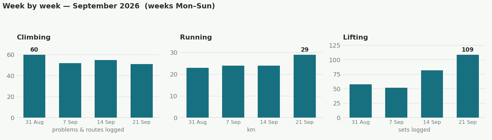
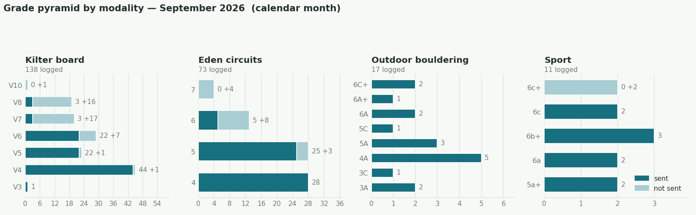
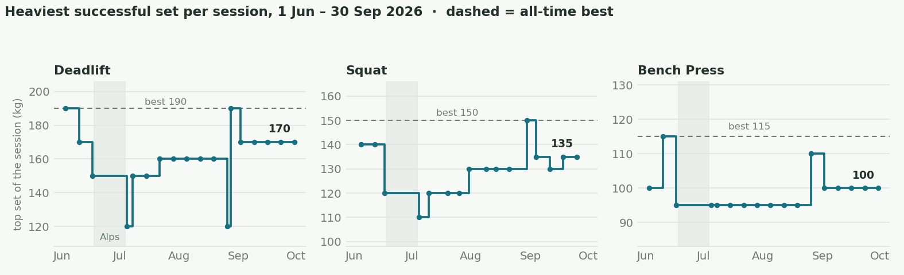
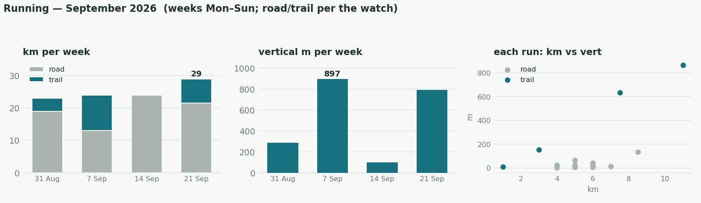
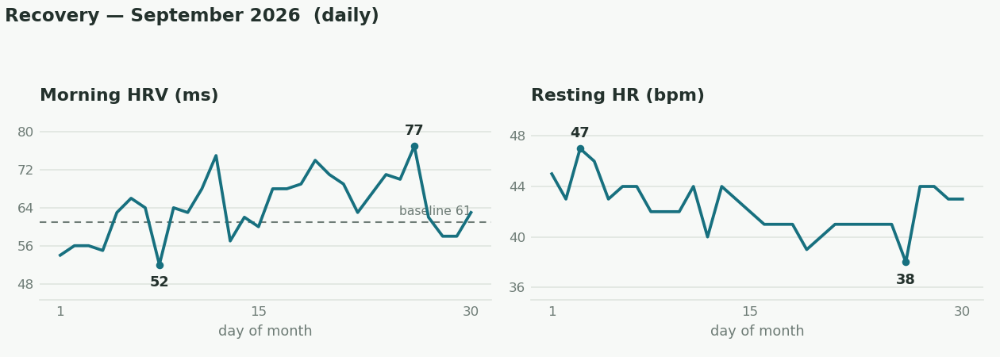
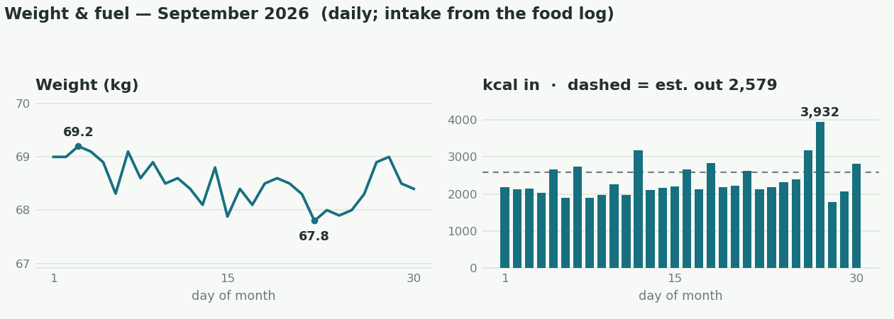

September was quite a big and successful month in terms of training (and performance)! Lots of everything, climbing, running, lifting. I broke my previous 5K PB by ~20s, sent my hardest boulder outdoors, the Mantelshelf at Bowden Doors, ~6C/+ (?, it used to be 7A), in only 3 tries (and then repeated it too), sent my first 7Bs on the Kilterboard. My weight finally broke 68kg and I felt strong and light on and off the wall. My sleep and recovery have been the best ever probably (in terms of HRV and RHR). 

## The month in numbers
- **Climbing**:
	- 239 problems & routes logged, 179 sent.
	- Kilter: first V8 sends — Clean The Tank (25 Sep), TRYOUT || Impossible || Dinis (27 Sep), Smelly in the cellar (29 Sep). Three V7 **flashes** (Direction of Chalk and Throwback Weekend — 8 Sep; Say Sike — 16 Sep).
	- Black Rock Desert (V8): 14 sessions this month, falling at the top — still open. 
	- Outdoors: **The Mantelshelf 6C+** at Bowden Doors (20 Sep)
- **Running**:
	- 115 km / 2,100 m elevation gain, 21 runs (calendar month).
	- Arthur's Seat 5 km, 19:31, avg HR 173 (5 Sep) — New PB! Super hard effort!
	- Longest: 11 km / 865 m, Pentlands (12 Sep).
- **Lifting**: 3×3 scheme all month at 170 / 135 / 100 (deadlift / squat / bench); weighted pull-up top +55 kg × 2 (27 Sep).
- **Football**: 3 Mondays (7, 14, 21 Sep). Have decided to stop going, for a while at least..

_Bars are Mon–Sun weeks with ≥4 days in September, so 28–30 Sep sits in October's chart._

## Climbing

So many tries on "Black Rock Desert", 7B, on the Kilterboard.. I've now fallen twice on the final move, either dry-firing off the second-to-last hold, or not catching the last hold well. I did send 3 other (and definitely softer) 7Bs, all in 4 tries or less (for context, I've done more than 40 tries on Black Rock Desert so far). This month I did way more volume around the 7A/V6 level too, which has been helpful to push the higher end. I think going into October, I'd like to switch back to doing some bigger volume sessions (not so much at 6B/V4 level now, but higher) and working on my power endurance with shorter rests between attempts (and potentially incorporating proper 4x4-style sessions), in order to not power out on longer problems. 

## Fingers

- Tindeq Progressor arrived 23 Sep. First max pulls, 20 mm (24 Sep): right 66.1 kg, left 60.4 kg.
- One-arm hang 20 mm: −15 kg × 7 s both arms (19 and 29 Sep); right also hung bodyweight × 5 s (11 Sep).

## Lifting

All my lifts have heavier working sets now (170kg for deadlift, 135 for squat, 100 for bench), all at least 3 reps, and all at least 3 sets, moving also closer to 4x4 by the end of the month. Hopefully, this period will pay off next month if all goes well, and towards the end I can do another 1RM testing session and see whether I can break some PBs!
## Running

Increased the total distance by quite a bit (87km last month to 115km), with a bit less elevation. My efficiency has improved quite a bit, so I'm now running at 5:00min/km pace at ~130-133 bpm average HR, much better than a few months ago when it was around 140bpm at the same pace. My VO2max estimate by Garmin hit 61 for the first time ever this month!

## Recovery

- Morning HRV averaged 64 ms (range 52–77), above the 61 ms baseline for most of the month.
- Resting HR averaged 42 bpm (range 38–47).

You can see how both numbers are trending in the right direction. Just before the end of the month, I caught a little cold which explains the reversal, but it's already resolved I think. 

## Weight & fuel

- Weight: 69.0 kg (1 Sep) → 68.4 (30 Sep) · low 67.8 · final-week mean 68.4.
- Protein: 173 g/day mean · ≥140 g floor on 29 of 30 days.
- Intake ~2,360 kcal/day vs ~2,580 estimated expenditure (energy-balance estimate, not the watch).
- Food logged 30/30 days.

Overall, I was very happy with my nutrition and weight this month. There has been a lot of progress and it has driven improvements in both climbing and running, and in recovery as well (there's a well-supported and strong relationship between my weight and HRV for example). My body image has been the best it has been in recent memory. Had a couple of binges towards the end of the month (I ate my entire batch of 10 protein bars in one day, on 2 sittings! 2500+ kcal!), but I think they were related to the cold I got, and I think I managed to stop the spiral relatively early before it completely unraveled and disrupted my training etc. 
